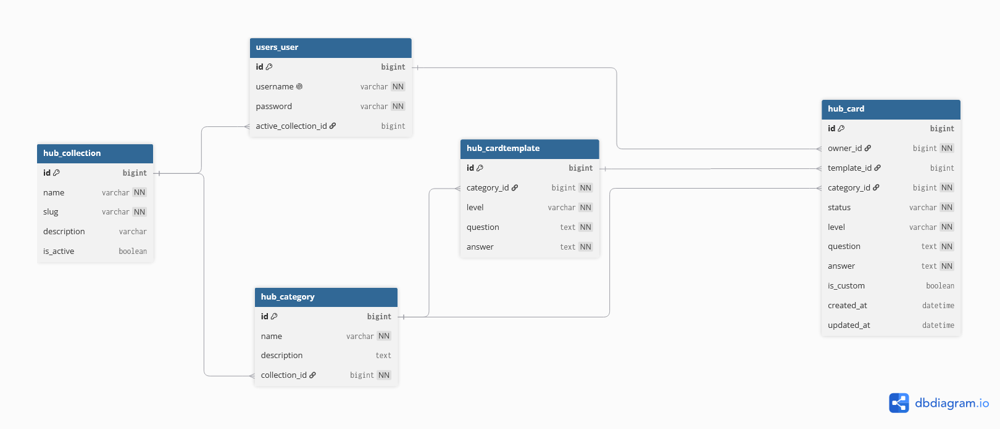
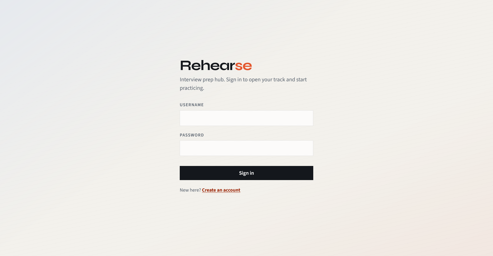
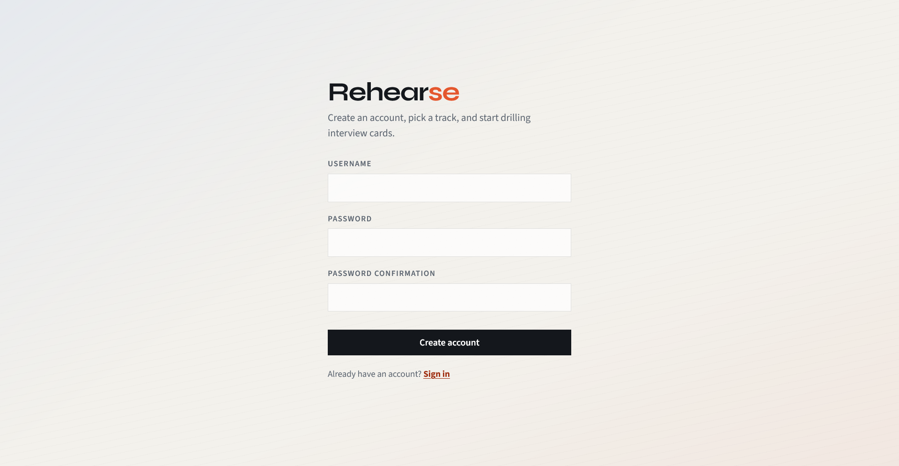
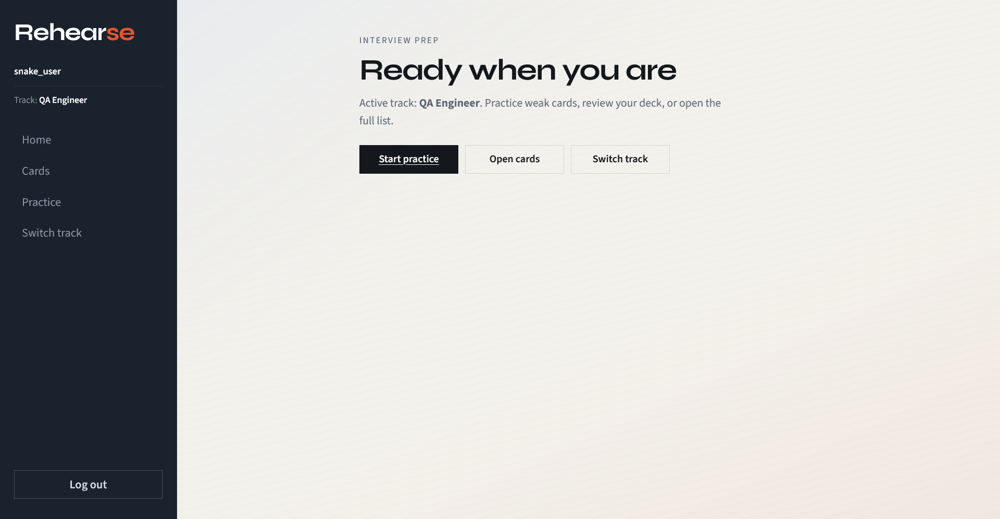
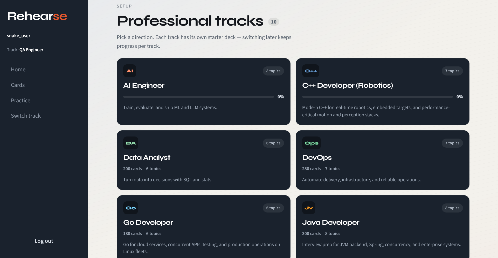
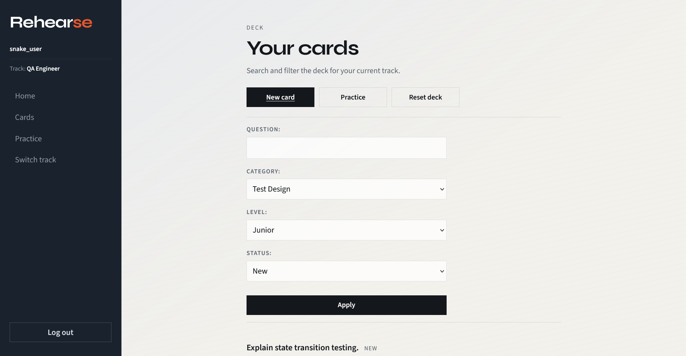
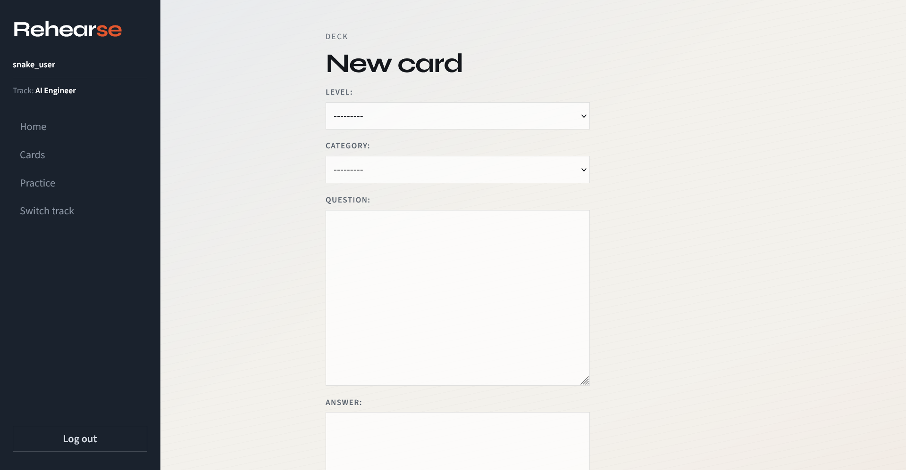
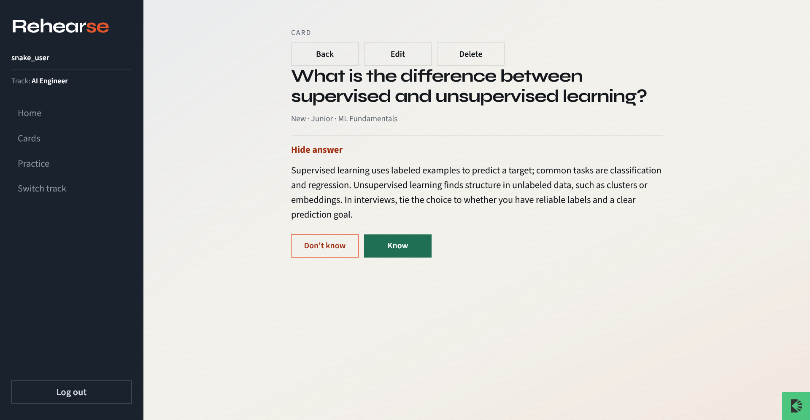
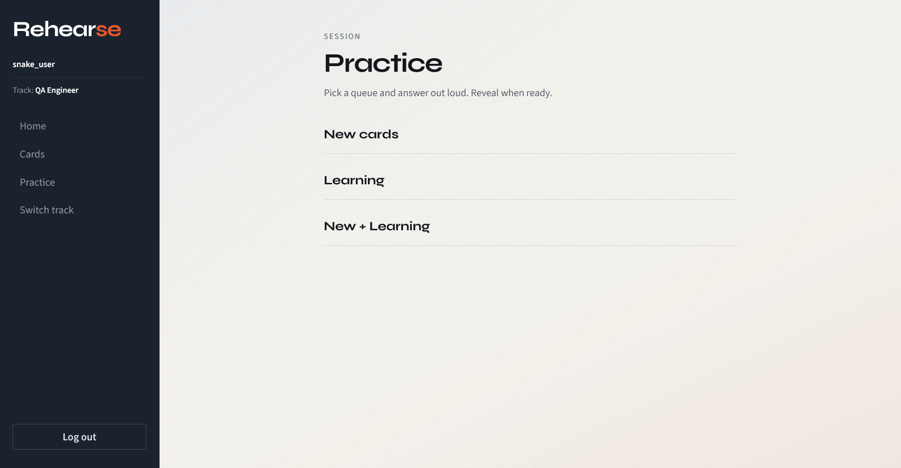

# Rehearse

Interview prep app on Django.

Live: [https://rehearse-gsp7.onrender.com](https://rehearse-gsp7.onrender.com)

You pick a track (Python, Java, DevOps, etc.), get a bunch of starter questions, and practice them. Mark cards as learning / known / mastered, search, filter, reset the deck if you want a clean start.

I worked on `develop`. PR goes into `main`.

## How to run

```bash
python -m venv .venv
```

Windows:
```bash
.venv\Scripts\activate
```

Linux/mac:
```bash
source .venv/bin/activate
```

```bash
pip install -r requirements.txt
python manage.py migrate
python manage.py seed_catalog
python manage.py runserver
```

Then open http://127.0.0.1:8000/accounts/register/  
Register → choose a track → cards get copied for you.

Need admin? `python manage.py createsuperuser`

If you already have cards for a track and re-seeded templates, hit **Reset deck** on the cards page.

## What's inside

- register / login / logout
- tracks as cards (not a boring select)
- CRUD for your own cards
- search + filters (category, level, status)
- pagination on the list (20 per page, otherwise 300 cards is painful)
- practice mode
- reset for current track
- admin for collections / categories / templates

Apps: `users`, `hub`.  
Bootstrap is there + my own CSS in `static/css/styles.css`.  
SQLite for local.

Question banks live in `hub/catalog_data/*.json`. `seed_catalog` loads them into the DB.

Rough sizes right now:

- Python / Java / AI — 300 each
- DevOps — 280
- C++ robotics — 220
- Rust / Data analyst — 200 each
- Go / Kotlin / QA — 180 each

~2340 templates total. Levels mixed junior–senior.

## Models (short)

```
User -> active Collection
Collection -> Category -> CardTemplate
User -> Card (copy from template, or custom)
```

Card has `level` and `status`. Status: new / learning / known / mastered.

## ER



## Screens










Same pics in the PR description.

## Extra notes

Switching track doesn't delete the other one — each collection keeps its own cards.

To add another track later: drop a json into `hub/catalog_data`, maybe add slug to `TRACK_ORDER` in `hub/catalog_seed.py`, run `seed_catalog` again.
